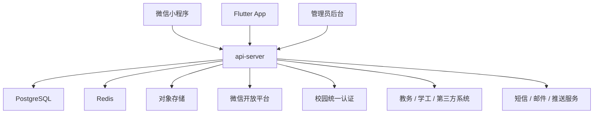

# 校园综合应用总体架构

## 1. 架构结论

本项目采用“`单仓库 + Go 模块化单体后端 + 多客户端 + 契约驱动`”方案。

核心判断如下：

- 对于校园综合应用，业务域多、角色多、系统集成多，但早期团队规模通常有限。
- 如果一开始就拆微服务，会把复杂度提前转移到运维、链路、数据一致性、联调上。
- 更合理的起点是：后端先做“强边界的模块化单体”，等团队、流量、组织边界成熟后再拆服务。
- 客户端应做到“多端表现不同，业务语义一致”；业务真相只保留一份，在后端。
- 仓库结构、架构文档、执行计划从第一天起对 AI 友好，避免后续上下文失真。

## 2. 适用范围

本方案适用于以下目标场景：

- 学生端：跑腿、组局（含拼车等轻社交撮合）、二手交易、资料、失物招领、消息、个人中心，后续扩展教务能力
- 教师端：通知、活动协作、基础服务、部分教学信息查看
- 管理端：内容运营、用户与角色、校园生活内容审核、联系方式权限策略配置、通知发布、统计分析
- 外部系统接入：统一身份认证、教务系统、学工系统、对象存储、短信、微信开放平台

## 3. 总体系统图



## 4. 为什么不用微服务起步

| 方案      | 结论  | 原因                               |
| ------- | --- | -------------------------------- |
| 微服务起步   | 不推荐 | 团队早期会被网关、服务发现、链路治理、分布式事务、环境一致性拖慢 |
| 模块化单体起步 | 推荐  | 能保留清晰边界，又能大幅降低交付和维护复杂度           |

后续拆分标准：

- 某个业务域有独立团队长期维护
- 某个业务域流量、资源消耗、发布节奏明显独立
- 模块内部边界稳定，数据模型已沉淀
- 观测数据证明拆分收益大于成本

## 5. 单仓库结构

```text
.
├── apps/
│   ├── admin-web/
│   ├── miniapp-wechat/
│   └── mobile-flutter/
├── packages/
│   └── contracts/
├── services/
│   └── api-server/
├── docs/
├── ops/
└── .agent/
```

选择单仓库的原因：

- 业务模型、接口契约、文档、计划集中管理
- 便于统一代码规范、CI、版本管理
- 便于 AI 代理快速定位上下文和依赖关系

## 6. 业务域拆分

建议从以下业务域建模：

| 业务域            | 说明               | 核心对象                          |
| -------------- | ---------------- | ----------------------------- |
| `iam`          | 统一身份、角色、组织、租户/校区 | user、role、permission、org                                  |
| `portal`       | 首页内容、公告、轮播、资讯    | article、banner、notice                                     |
| `campus_life`  | 跑腿、组局、二手交易、资料、失物招领 | errand、meetup、listing、resource、lost_item、claim、contact_acl |
| `academic`     | 后续教务能力：课程表、考试、成绩、学期信息 | course、schedule、exam、grade                                |
| `notification` | 站内信、短信、微信订阅消息、推送 | message、template、delivery                                 |
| `file_center`  | 文件上传、附件引用、媒体资源   | file、bucket、attachment                                    |
| `analytics`    | 审计、运营统计、行为汇总     | audit\_log、event、dashboard                                |

说明：

- 学生端首发与默认登录入口以微信小程序为主，Flutter App 复用同一后端语义，提供更完整体验。
- `campus_life` 中的联系方式属于受限字段，必须由后端基于教务绑定状态裁剪后返回，客户端不得自行放开。
- `academic` 强依赖校园现有系统时，采用“连接器 + 同步任务”方式接入，不把第三方逻辑污染到领域层。
- 如果未来做多校区或 SaaS 化，`iam` 中应保留 `tenant_id` 或 `campus_id` 维度。

## 7. 后端架构

### 7.1 技术建议

- 语言：`Go`
- Web：`Gin` 或 `Fiber` 二选一；如果追求保守稳定，优先 `Gin`
- 数据库：`PostgreSQL`
- 缓存：`Redis`
- 对象存储：`COS`
- 接口文档：`OpenAPI`
- 异步任务：先用 `PostgreSQL Outbox + worker`，后续再评估消息队列
- 可观测性：`OpenTelemetry + Prometheus + Grafana + Loki`

### 7.2 目录与分层

后端推荐结构：

```text
services/api-server/
├── cmd/
├── internal/
│   ├── modules/
│   │   ├── iam/
│   │   ├── portal/
│   │   ├── campus_life/
│   │   ├── academic/
│   │   ├── notification/
│   │   ├── file_center/
│   │   └── analytics/
│   ├── providers/
│   └── platform/
├── api/
│   └── openapi/
└── migrations/
```

单个模块内部统一按以下方向依赖：

```text
types -> config -> repo -> service -> runtime -> transport
```

层职责如下：

| 层           | 责任                                      |
| ----------- | --------------------------------------- |
| `types`     | 实体、DTO、值对象、事件、错误码、状态枚举                  |
| `config`    | 模块配置、参数结构、装配入口                          |
| `repo`      | 数据库访问、缓存读写、查询对象                         |
| `service`   | 领域规则、用例编排、权限校验、状态流转                     |
| `runtime`   | 定时任务、同步任务、异步消费、跨域编排                     |
| `transport` | HTTP handler、admin handler、webhook、回调入口 |

### 7.3 外部集成策略

所有外部系统必须经 `providers` 层封装，至少包括：

- `wechat_provider`
- `sso_provider`
- `academic_provider`
- `sms_provider`
- `storage_provider`
- `push_provider`

禁止行为：

- 在 handler 中直接调微信 SDK
- 在 service 中直接拼第三方 HTTP URL
- 在任意业务模块中复制登录、签名、重试逻辑

### 7.4 数据一致性策略

- 同步业务走数据库事务
- 跨模块通知采用领域事件
- 事件投递采用 `outbox`，保证“写库成功后可重放”
- 外部回调必须支持幂等
- 关键写操作增加 `request_id` 或幂等键

### 7.5 权限模型

统一采用 `RBAC + 资源动作码`：

- 角色：学生、教师、辅导员、学院管理员、超级管理员
- 资源动作：`portal:publish`、`campus_life:moderate`、`contact:view`
- 数据权限：院系、班级、校区、内容归属范围

注意：

- 前端只能做权限展示优化，最终权限裁决在后端
- 管理端按钮级权限必须由服务端返回的权限码控制
- 联系方式等受限字段必须由服务端在读取时二次校验教务绑定状态，不能依赖前端隐藏按钮

## 8. 管理员后台架构

### 8.1 技术建议

- `Vue 3`
- `TypeScript`
- `Vite`
- `Pinia`
- `Vue Router`
- `Ant Design Vue`

### 8.2 设计原则

- 以“业务域”组织模块，不以页面列表堆目录
- 通过 `OpenAPI` 生成前端 SDK，避免手写大量接口层
- 表格、表单、筛选项尽量组件化与 schema 化
- 权限、菜单、字典项、上传、审计能力做成共享模块

推荐结构：

```text
apps/admin-web/
├── src/
│   ├── app/
│   ├── modules/
│   │   ├── iam/
│   │   ├── portal/
│   │   ├── campus-life/
│   │   ├── moderation/
│   │   └── analytics/
│   └── shared/
└── tests/
```

## 9. 微信小程序架构

### 9.1 技术结论

采用 `微信原生小程序`，不使用 Taro、Uni-app 等跨端方案。

原因：

- 校园场景会大量依赖微信登录、订阅消息、分享、二维码、支付、定位等原生能力
- 当前学生端默认登录入口就是微信小程序，原生能力可以最短路径承接登录和传播
- 原生小程序包体和性能更可控
- 与 Flutter 已经天然分端，没有必要再为“跨端统一”引入额外抽象层

### 9.2 结构建议

```text
apps/miniapp-wechat/
├── app.js
├── app.json
├── api/
├── pages/
├── components/
├── services/
├── stores/
├── behaviors/
├── utils/
└── subpackages/
```

关键约束：

- 主包只保留登录、首页、信息流、个人中心等高频入口
- 跑腿、组局、二手交易、资料、失物招领等中长流程放入分包
- `api/` 只负责路径、参数、鉴权头和低层传输；页面不直接依赖接口原始 DTO
- 服务层统一封装 `request`、鉴权、重试、错误码映射
- 页面只消费 `services/` 输出的业务语义或 view model，不在页面层推断联系方式、绑定状态等规则
- 默认使用微信小程序登录建立会话，教务绑定状态由后端会话与资料接口统一返回
- 未完成教务绑定的账号不能查看联系方式，前端只根据服务端返回的可见性状态渲染
- 使用局部 `setData` 更新，避免大对象全量覆盖
- 可复用区域优先写 `Component`

## 10. Flutter App 架构

### 10.1 技术建议

- 状态管理：`Riverpod`
- 路由：`go_router`
- 网络：`dio`
- 序列化：`json_serializable`
- 本地缓存：`drift` 或轻量缓存方案

### 10.2 架构模式

采用 `feature-first + MVVM + repository`：

```text
apps/mobile-flutter/
├── lib/
│   ├── features/
│   │   ├── auth/
│   │   ├── home/
│   │   ├── campus_life/
│   │   ├── academic/
│   │   └── profile/
│   ├── shared/
│   └── main.dart
└── test/
```

分层职责：

- `presentation`：页面、组件、ViewModel
- `data`：repository、remote datasource、local datasource
- `domain`：实体、用例、规则

客户端必须满足：

- 离线缓存仅做体验优化，不改变后端业务真相
- 复杂状态机规则不在 Flutter 重写
- 当前以跑腿、组局、二手交易、资料、失物招领等校园生活能力为主，后续再扩展教务功能
- 联系方式可见性与教务绑定状态必须完全复用后端语义
- 多端共用一套错误码和接口语义

## 11. 契约优先策略

`packages/contracts` 是跨端统一基础设施。

建议内容：

- `openapi/`：对外 REST 契约
- `events/`：领域事件定义
- `dictionary/`：状态枚举、字典项、资源动作码
- `sdk-js/`：给管理后台和小程序使用的生成 SDK
- `sdk-dart/`：给 Flutter 使用的生成 SDK

原则：

- 后端先改契约，再改实现
- 客户端优先升级 SDK，而不是手改接口层
- 破坏性变更必须有版本策略

## 12. 数据与基础设施

### 12.1 数据存储

- `PostgreSQL`：事务型主存储
- `Redis`：缓存、验证码、会话、短期热点数据
- `对象存储`：文件、图片、活动海报、导出报表

### 12.2 表设计建议

- 按业务域分表前缀或 schema
- 审计字段统一：
  - `created_at`
  - `updated_at`
  - `created_by`
  - `updated_by`
  - `deleted_at`
- 可扩展对象保留 `ext_json`，但不能滥用成“万能黑盒”

### 12.3 外部系统同步

对教务、学工等系统采用“双轨”策略：

- 实时查询：适合低频、低延迟要求的场景
- 定时同步：适合课程表、成绩、考试安排等稳定数据

同步任务统一放在 `runtime` 层，不直接放业务 handler。

## 13. 安全与合规

必须从第一天落地：

- 接口鉴权
- RBAC
- 数据脱敏
- 审计日志
- 文件上传安全校验
- 敏感配置通过密钥管理系统注入
- 管理员关键操作二次确认和操作留痕

## 14. 可观测性与运维

必须具备：

- 统一 `trace_id`
- 结构化日志
- 核心接口耗时与错误率监控
- 登录、首页信息流浏览、信息发布、教务绑定、联系方式查看等关键链路埋点
- 数据库备份与恢复演练

建议 SLO：

| 指标              | 目标        |
| --------------- | --------- |
| 核心 API 可用性      | `99.9%`   |
| 登录接口 p95        | `< 500ms` |
| 首页信息流接口 p95     | `< 300ms` |
| 联系方式解锁成功率       | `> 99.5%` |
| 校园生活信息发布成功率     | `> 99%`   |

## 15. AI 协作要求

受 OpenAI `Harness Engineering` 思路启发，本仓库要求：

- `AGENTS.md` 只做导航与硬约束，不堆长篇教程
- `docs/` 作为真实系统记录，而不是装饰性文档
- 计划文件和设计文档与代码同等重要
- 通过清晰目录、明确边界、统一命名，降低 AI 上下文丢失概率
- 对关键模块持续维护质量评分与文档新鲜度

## 16. 推荐实施阶段

### 阶段 0：基础工程

- 仓库骨架
- 架构文档
- 统一契约目录
- CI 基础校验

### 阶段 1：基础域 MVP

- 统一登录
- 用户与权限
- 内容门户
- 通知消息
- 管理员后台基础能力

### 阶段 2：校园核心能力

- 跑腿
- 组局 / 拼车等轻社交撮合
- 二手交易
- 资料共享
- 失物招领

### 阶段 3：体验增强与教务扩展

- 教务能力接入（课程表 / 考试 / 成绩）
- 推送与订阅消息
- 数据分析看板
- 多校区或多租户演进
